# WeGetFinancing Payment Checkout for WooCommerce

Increase sales volume and conversion of your WooCommerce by offering instantaneous credit at point of purchase.

WeGetFinancing allows merchants to offer flexible financing options to their customers.

## 1. Description of the Plugin

The WeGetFinancing payment gateway is specifically designed for e-commerce merchants.

Our payment gateway offers different financing options to your customers at checkout, providing a convenient and flexible way for them to pay for their purchases.

This can help to increase your sales and customer satisfaction by providing an easy and accessible way for customers to finance their purchases.

Our plugin allows you to offer:

* Multiple lenders: More lenders, more approvals for your customers.
* Real-time instant approval: Allow your customers to access financing easily.
* All credit types: Approve customers of all credit types.
* Secure payment processing: All transactions are safe inside our secure platform.
* Detailed reporting and analytics: Detailed analytics of your financed sales.

## 2. User Manual

This user manual is written for all users, including those without technical experience. It provides clear, step‑by‑step instructions to help you easily install, configure, and test the WeGetFinancing WooCommerce Checkout plugin on your store.

### 2.1. How to install

In this section, you will learn how to install the WeGetFinancing WooCommerce Checkout plugin on your WordPress site using simple, guided steps. You can follow the recommended installation through the WordPress marketplace or, if needed, use the manual installation via a ZIP file.

#### 2.1.1. Via the WordPress Market (recommended)

This is the preferred installation method for most users, ensuring a streamlined, secure, and fully supported setup process.

1. Download the plugin, it's called "WeGetFinancing Payment Gateway", from the WordPress Market and install.
2. Once installed, go to Plugins > Installed Plugins.
3. Find the plugin, and click on the "Activate" button.
   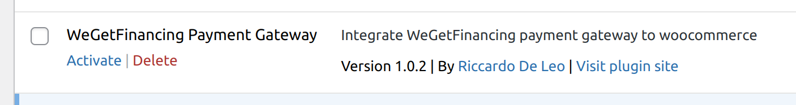

#### 2.1.2. Via the plugin.zip file

This installation method is provided as an alternative for advanced users or specific deployment scenarios where access to the WordPress Market is limited.

1. Download the github zip as shown in the next image.
   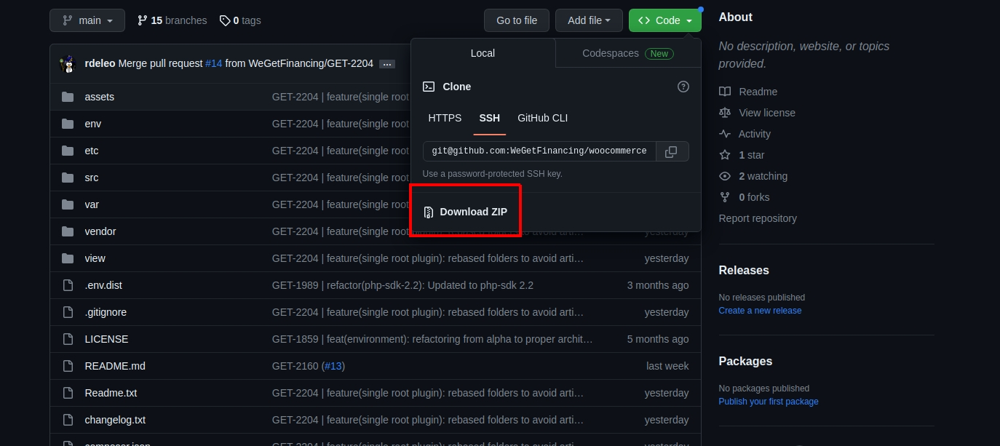
2. Log in into your WordPress installation, ensure you have administrative privileges.
3. Go to Plugins > Add New.
4. Click on the button "Upload Plugin", it is positioned nearby the header "Add Plugins"
5. Click on the button "Choose file" to select the plugin.zip file that you downloaded before
6. Proceed with Install Now and follow the instructions
7. Once installed, go to Plugins > Installed Plugins
8. Find the plugin, it's called "WeGetFinancing Payment Gateway", and click on  the "Activate" button
   

### 2.2. Configuration

In this section, you will learn how to configure the WeGetFinancing WooCommerce Checkout plugin using a simple, step‑by‑step approach. We will guide you through entering your credentials, adjusting key options, and ensuring the plugin is correctly set up to work with your store.

#### 2.2.1. First set up

1. Take the Merchant Token ID:
   1. Connect into our partner portal, the url depends on the environment:
      - Production https://partner.wegetfinancing.com/portal/
      - Sandbox https://partner.sandbox.wegetfinancing.com/portal/
   2. Log in with your credentials
   3. From the left menu, select "Integration" > "API integration"
      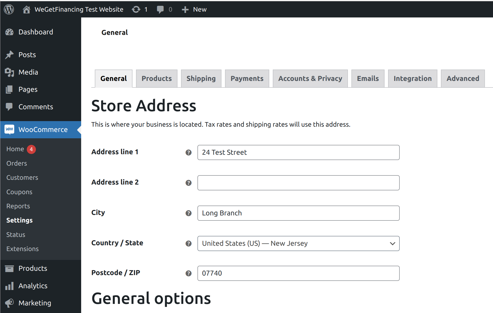
   4. Copy Merchant ID, Username adn Password
      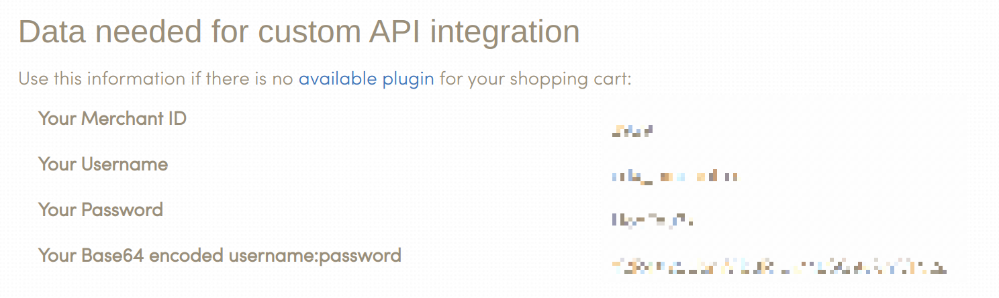
   5. Log out of the portal
2. Log in into your WordPress installation, ensure you have administrative privileges and woocommerce installed.
3. Click on the main tab "Payments"
   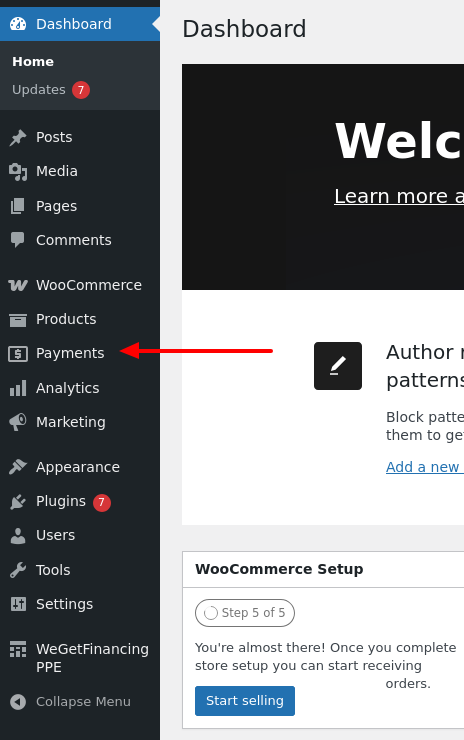
4. You can see our plugin called "WeGetFinancing"
5. Click on the "Finish set up" button on the right side. 
   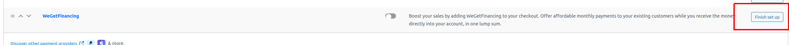
6. You will see a form like the following one:
   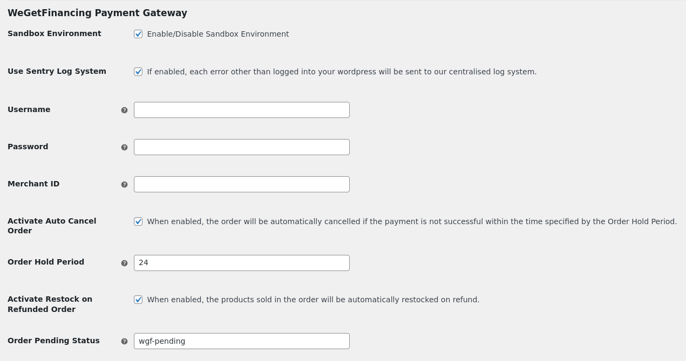
   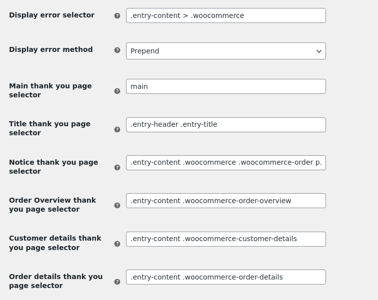
   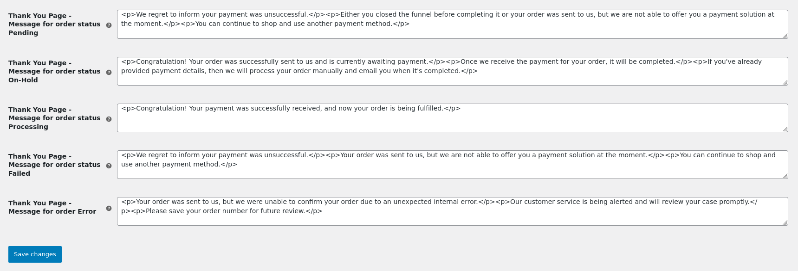
7. Complete the form using the following guidelines:
   1. *Sandbox Environment*: if enabled, all the API calls will pass through the sandbox environment, otherwise to production.
   2. *Use Sentry Log System*: when enabled, non-authenticated errors occurring in your WordPress site will be sent to our centralized logging system, helping our support team diagnose and resolve issues more efficiently.
   3. *Username*: the username from the WeGetFinancing portal.
   4. *Password*: the password from the WeGetFinancing portal.
   5. *Merchant ID*: the merchant ID from the WeGetFinancing portal.
   6. *Activate Auto Cancel Order*: if enabled, the order will be automatically canceled if the customer doesn't pay in the time configured by the following field.
   7. *Order Hold Period*: the time in hours after which the order will be automatically canceled if the customer doesn't pay.
   8. *Activate Restock on Refunded Order*: when enabled, the products sold in the order will be automatically restocked on refund.
   9. *Order Pending Status*: internal order status used while WeGetFinancing is processing the application; normally you can keep the default value.
   10. *Display error selector*: the CSS selector that identifies where error messages will be displayed on the checkout page. The default value works well with the standard WooCommerce template.
   11. *Display error method*: determines whether the error message is added before (prepend) or after (append) the element selected above. The default value works well with the standard WooCommerce template.
   12. *Thank You Page – Message for order status Pending / On‑Hold / Processing / Failed / Error*: HTML content shown to customers on the order received page for each corresponding order status. You can customize these messages to provide clear guidance about the outcome of the financing request.
   13. *Main thank you page selector*: CSS selector for the main container of the WooCommerce order received page where the plugin will look to place or adjust messages.
   14. *Title thank you page selector*: CSS selector for the main title element on the order received page.
   15. *Notice thank you page selector*: CSS selector for the area where WooCommerce displays order notices and status information.
   16. *Order Overview thank you page selector*: CSS selector for the order summary section (order items and totals) on the thank you page.
   17. *Customer details thank you page selector*: CSS selector for the section displaying the customer’s billing and shipping details.
   18. *Order details thank you page selector*: CSS selector for the detailed order information area on the thank you page.
8. Click on the "Save Changes" button, if successfully saved, it will show you the following success note:
   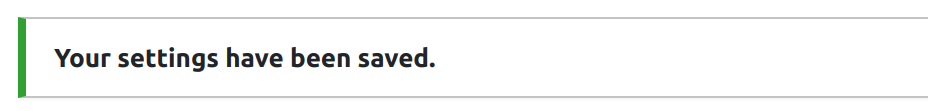
9. Come back to Payments 
10. In the main payment table, click the button "Enable" as per the following screenshot
    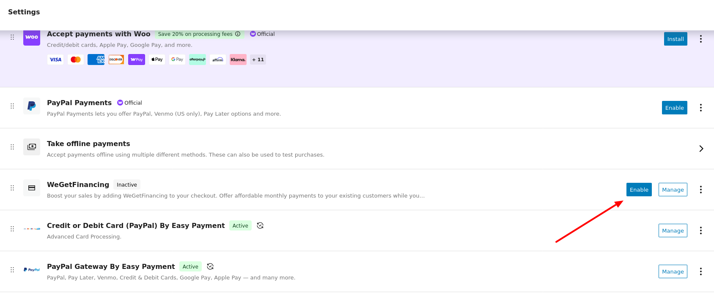
11. Ensure that the WordPress Cron system (WP-Cron) is enabled and running correctly, as scheduled tasks may be required for optimal processing of financed orders and automated actions (such as order status updates).

#### 2.2.2. Cart and Checkout Gutenberg Blocks

Starting with WooCommerce version 8.3, the Cart and Checkout Blocks are the default for new installations. These blocks are part of a ground-up rebuild of the checkout flow, based on industry best practices which offer conversion-optimized features and a simplified shopper flow. With easy customization options, you can maintain your brand identity and provide a visually appealing and consistent checkout journey for your customers.

These new blocks are fully functional and most extensions developed by WooCommerce fully support the block-based cart/checkout at this time. However, a plugin/extension running on your store may not work as expected. The cart and checkout shortcodes will continue to be available in WooCommerce Core for existing stores that have customized checkout flows requiring them, and for any new stores that have specific needs not yet possible with the Cart and Checkout blocks.

WeGetFinancing Checkout Plugin support both traditional (legacy) templates accessed through shortcodes and modern Gutenberg blocks.

For more information on how to switch between the two, please follow the [Official WooCommerce Documentation](https://woocommerce.com/document/cart-checkout-blocks-status/).

#### 2.2.3. Configure PPE

1. Take the Merchant Token ID:
   1. Connect into our partner portal, the url depends on the environment: 
      - Production https://partner.wegetfinancing.com/portal/
      - Sandbox https://partner.sandbox.wegetfinancing.com/portal/
   2. Log in with your credentials
   3. From the left menu, select "Integration" > "Conversion boosters"
   
      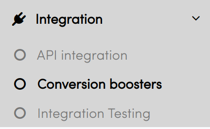
   4. Copy the Token ID
      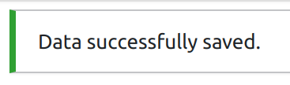
   5. Log out of the portal
2. Log in into your WordPress installation, ensure you have administrative privileges.
3. From the main lateral menu, select "WeGetFinancing PPE"
   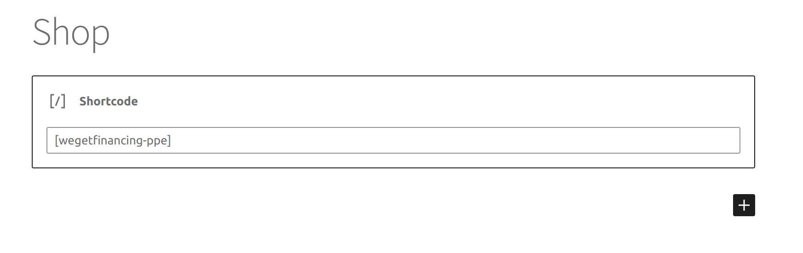
4. You'll see the following configuration form:
   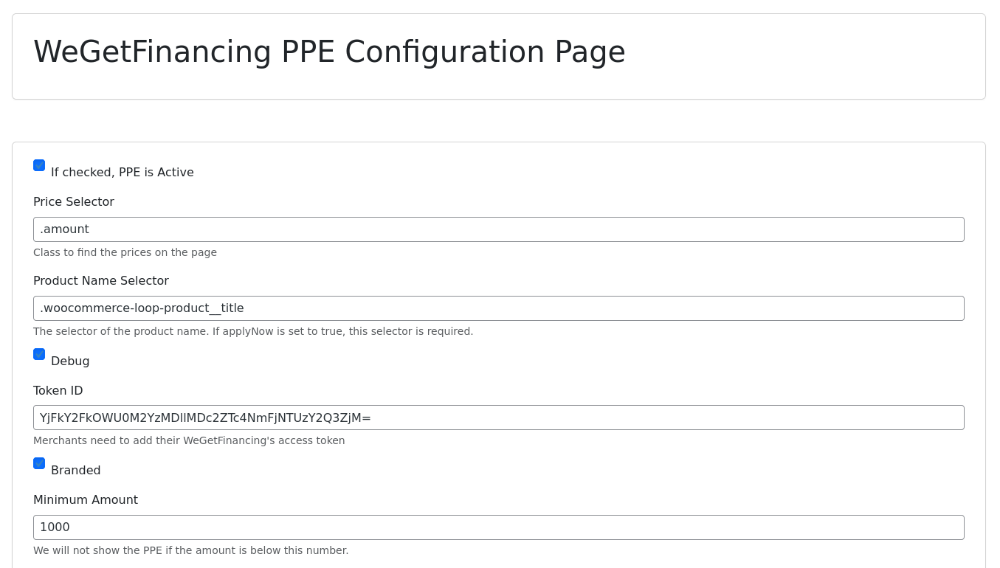
5. Complete the form, use the token id from the partner portal, and configure the other options according to your preferences using the following guidelines:
   1. *If checked, PPE is Active*: enable this option to activate the WeGetFinancing PPE widget on the selected pages.
   2. *Price Selector*: CSS selector used to locate the product prices on the page (for example, `.amount`). The widget uses this to calculate and display the monthly payment information.
   3. *Product Name Selector*: CSS selector for the product title element (for example, `.woocommerce-loop-product__title`). This is required when Apply Now functionality is enabled so the correct product name is sent to WeGetFinancing.
   4. *Debug*: when enabled, additional technical information is logged in the browser console to help diagnose integration issues. It is recommended only for testing or troubleshooting.
   5. *Token ID*: the PPE Token ID copied from the WeGetFinancing partner portal. This securely links the widget on your site to your WeGetFinancing merchant account.
   6. *Branded*: when enabled, the widget will display WeGetFinancing branding. Disable it only if you need a more neutral presentation based on your design guidelines.
   7. *Minimum Amount*: minimum cart or product amount for which the PPE widget will be shown. If the price is below this value, the widget will not appear.
   8. *Custom Text*: optional text displayed before the monthly payment message under the price (for example, “or just”). Use this to better match your store’s tone of voice.
   9. *Hover*: when enabled, additional information or emphasis is shown when customers hover over the widget, improving the visibility of financing details.
   10. *Font Size*: font size of the widget text expressed as a percentage (for example, `90` for 90%). Adjust this to align the widget visually with the rest of your theme.
   11. *Position*: controls the horizontal alignment of the PPE widget. Valid values are `flex-start`, `center`, or `flex-end`, corresponding to left, center, or right alignment within its container.
6. Click on the "Save Changes" button, If everything is correct, you will receive a success message like this
   
7. The PPE widget should appear in the selected page
   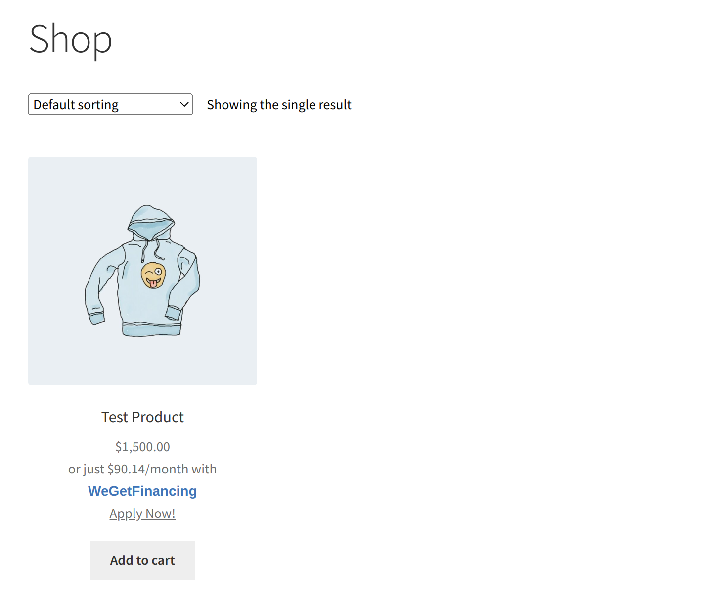

### 2.3. Test the plugin

1. Open an incognito windows, or another browser, or be sure you're not logged in into the WordPress. **The plugin doesn't work if you have a logged-in session.**
2. Add one or more products in the cart
3. Go to the checkout page
4. Under the payment options you'll see "WeGetFinancing"
5. If the option is selected, the "Place order" button will be replaced with "Check out with WeGetFinancing" one.
6. Click on the last button to proceed with WeGetFinancing Funnel

## 3. Development Manual 

This part is intent only for skilled technical people.

### 4.1 Prepare your development environment

1. If this is the first time you've cloned this repository, please ensure that 
   1. You have been installed `docker`, `apg`, `make` and `direnv`, please refer to the relative official documentation to find instruction on how to install on your environment. 
   2. If you need to edit the `.envrc` file, please copy to `.envrc.local` and edit it as per your needs.
   3. Please read the file compose.yaml and edit at your convenience.
   4. Copy the file `.env.dist` to `.env` and configure per your needs.`
2. Run `make up-d` to initialize and run your environment.

### 4.2. Re-Install a fresh version of WordPress:

1. Ensure that all the containers are down
   ```
   make down-v
   ```
2. Delete any content inside the folders "./var/wp" but not the folders itself
   ```
   rm -rf ./var/wp/*
   ```
3. Start docker-compose
   ```
   make up-d
   ```
   
### 4.3. Regenerate vendors

To regenerate optimized vendors for your version of php, use the following command:

```
docker compose run --rm composer install
```

### 4.4. Compile Gutenberg plugin

Our plugin requires Gutenberg blocks to work properly. 
To compile the Gutenberg plugin, you need to install node.js and npm on your local machine.
E.G. Install node on debian machine:

```
sudo apt-get install -y curl && \
   curl -fsSL https://deb.nodesource.com/setup_23.x -o nodesource_setup.sh && \
   sudo -E bash nodesource_setup.sh && \
   sudo apt-get install -y nodejs
```

Then follow the steps below:

1. Install the latest version of the JavaScript dependencies
    ```
    npm install
    ```
2. Build the latest version
    ```
    npm run build
    ```
