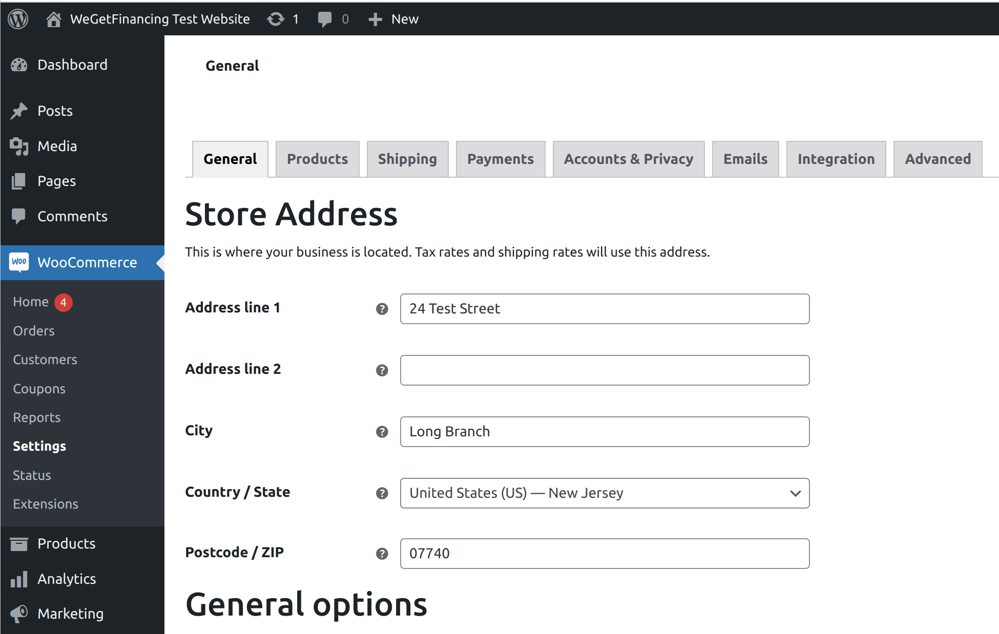
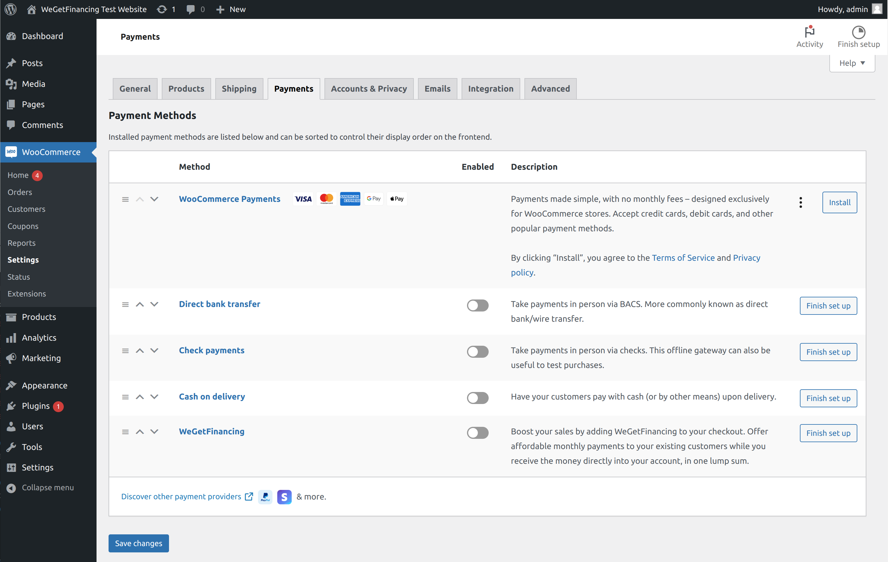

# WeGetFinancing Payment Checkout for WooCommerce

Increase sales volume and conversion of your WooCommerce by offering instantaneous credit at point of purchase.

WeGetFinancing allows merchants to offer flexible financing options to their customers.

## 1. Description of the Plugin

The WeGetFinancing payment gateway is specifically designed for e-commerce merchants.

Our payment gateway offers different financing options to your customers at checkout, providing a convenient and flexible way for them to pay for their purchases.

This can help to increase your sales and customer satisfaction by providing an easy and accessible way for customers to finance their purchases.

Our plugin allow you to offer:

* Multiple lenders: More lenders, more approvals for your customers.
* Real-time instant approval: Allow your customers to access financing easily.
* All credit types: Approve customers of all credit types.
* Secure payment processing: All transactions are safe inside our secure platform.
* Detailed reporting and analytics: Detailed analytics of your financed sales.

## 2. How to install

### 2.1. Via the plugin.zip file

1. Download the plugin.zip file provided in the root directory of this GitHub repository
2. Log in into your WordPress installation, ensure you have administrative privileges.
3. Go to Plugins > Add New
4. Click on the button "Upload Plugin", it is positioned nearby the header "Add Plugins"
5. Click on the button "Choose file" to select the plugin.zip file that you downloaded before
6. Proceed with Install Now and follow the instructions
7. Once installed go to Plugins > Installed Plugins
8. Find the plugin, it's called "WeGetFinancing Payment Gateway", and click on  the "Activate" button
   
## 3. Configuration

### 3.1 First set up

1. Log in into your WordPress installation, ensure you have administrative privileges.
2. Go to WooCommerce > Settings
   
3. Click on the tab "Payments"
   
4. You can see our plugin called "WeGetFinancing", enable it with the relative check
5. Click on the "Save Changes" button
6. Click on the "Finish set up" button, you will see a form like the following one:
   
7. Insert your credentials in the relative fields and click on the "Save Changes" button
8. If successfully saved, it will show you the following success note
   

### 3.2 Test the plugin

1. Open an incognito windows, or another browser, or be sure you're not logged in into the WordPress. The plugin doesn't work if you have a logged-in session.
2. Add one or more products in the cart
3. Go to the checkout page
4. Under the payment options you'll see "WeGetFinancing"
5. If the option is selected, the "Place order" button will be replaced with "Check out with WeGetFinancing" one.
6. Click on the last button to proceed with WeGetFinancing Funnel

## 4. Development environment 

This part is intent only for skilled technical people.

### 4.1. Install a fresh version of WordPress:

1. Configure your .env file
2. Ensure that all the container are down
   ```
   docker-compose down -v --remove-orphans
   ```
3. Delete any content inside the folders "./var/wp" but not the folders itself
   ```
   rm -rf ./wp/*
   ```
4. Start docker-compose
   ```
   docker-compose up -d
   ```
   
### 4.2. Regenerate vendors

To regenerate optimised vendors for your version of php, use the following command:

```
docker-compose run --rm composer install
```
